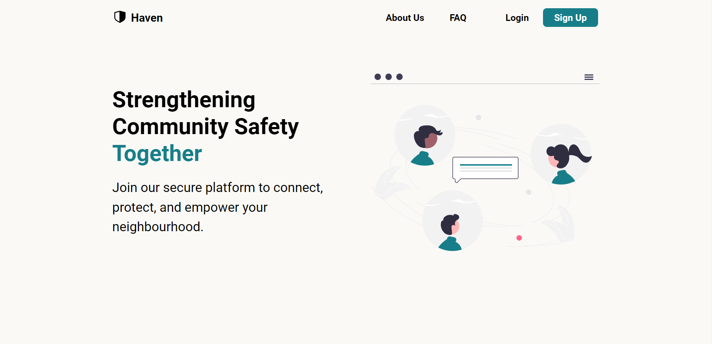
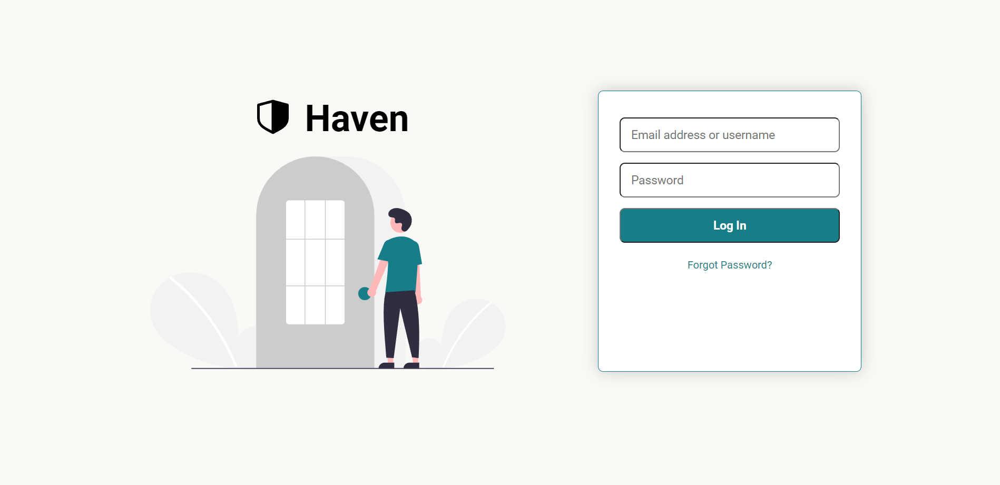

# Haven Safety Network

Welcome to the Haven Safety Network project repository! This is a platform dedicated to enhancing community safety and fostering a secure environment for neighbors to connect and collaborate.

⚠️ **Please Note**: This project is currently a work in progress. I'm in the process of learning the necessary technologies and skills to develop this into a full-fledged working application. The repository will be continuously updated as I make progress and implement new features.

### Landing Page

## Table of Contents

-   [Overview](#overview)
-   [Project Status](#project-status)
-   [Screenshots](#screenshots)
-   [Getting Started](#getting-started)
-   [License](#license)

## Overview

Haven Safety Network is a web application aimed at strengthening community bonds and safety awareness. The landing page and login page have been implemented using HTML and CSS.

## Project Status

As of now, the project includes the following:

-   Landing Page: An introductory page that conveys the purpose of the platform.
-   Login Page: A page for users to log in to the platform.

## Screenshots

### Login Page

## Getting Started

Since this project is under development, there's no need for installation or usage instructions at the moment.

## License

This project is licensed under the [MIT License](LICENSE).
